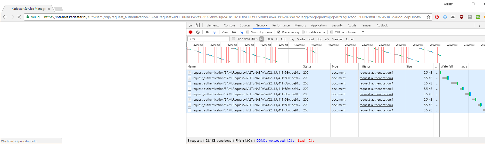
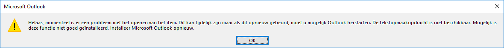

# Windows 10 Capgemini Bevindingen

Testers: Walter van Iterson, Marc van Andel

## Logboek

_(Items over inrichting en activiteiten)_

_2017-10-26 MvA_: Nieuwe image geïnstalleerd. Dat ging de eerste keer fout, want Ronald Ruijs moest een BIOS aanpassing doen (oid?) om vervolgens nogmaals het image in te spoelen. Dat was wel binnen een uur klaar. Na inloggen e.d. kon ik direct aan de slag.

_2017-10-30 MvA_: Mbv mijn [Lenovo pagina](http://github.so.kadaster.nl/andelm/local-dev-env/blob/master/lenovo.md) alle tools gedownload en geïnstalleerd. Wat gaat dat allemaal goed! Cisco AnyConnect is standaard al deel van het image en werkt direct. Super! Naar en van slaapstand werkt heel goed. Geen BSoD meer (op dit moment)! En snel!

_2017-10-31 WvI_: De nieuwe, voorgeïnstalleerde laptop ligt klaar bij local support. Eén klein probleempje: er is vandaag niemand op de Brug aanwezig. Morgenochtend mag ik hem ophalen

_2017-11-01 MvA_: [Install Bash on Windows 10](https://www.howtogeek.com/249966/how-to-install-and-use-the-linux-bash-shell-on-windows-10/); Windows 10 Developer Mode geeft een error. Bash is wel te 'enable'n.

_2017-11-01 MvA_: Docker werkt super!! KOERS draaide in één keer zonder problemen, ook in Docker Swarmmode :D

_2017-11-02 WvI_: Bij local support langs geweest, de aanvraag voor de tweede laptop was geweigerd. Inmiddels is de toestemming wel (weer) gegeven, dus zullen ze de laptop vandaag in gaan richten

_2017-11-03 MvA_: Ik moest mijn periodieke wachtwoord wijzigen en dat heb ik gedaan na het inloggen op de VPN. Vervolgens kreeg ik de melding in Windows om te vergrendelen en met mijn nieuwe wachtwoord te ontgrendelen ... GREAT! Dat werkt gewoon in één keer!! Top!

_2017-11-06 WvI_: Weer een bezoekje aan local support. Mijn laptop ligt klaar, alleen zeggen ze dat er geen goedkeuring van een manager is. Bij Johan Borger langsgegaan, hij heeft de bevestiging in zijn mailbox. Hij zou bij local support (of de KSD?) langswandelen. Eind van de middag nogmaals langs local support, daar hebben ze hem nog niet gezien. Volgens mij wordt dit een test of het me lukt om vóór het eind van de testperiode een laptop te bemachtigen

_2017-11-07 WvI_: Er worden nu 2 verschillende omruil-scenario's onderkend: Enerzijds de mensen die gewoon een nieuw image willen laten inspoelen, anderzijds de mensen die tijdelijk 2 systemen naast elkaar willen draaien. Ik heb een laptop op mijn buro liggen!

_2017-11-14 WvI_: Na een weekje gebruik eigenlijk weinig te melden. Ik krijg af en toe een popup + geluid van Sophos Safeguard updates. Die zou ik liever niet hebben, maar verder lopen zowel de installatie als het gebruik van diverse programma's op rolletjes

_2017-11-15 WvI_: Vanmorgen mocht ik mijn wachtwoord wijzigen. Nieuw wachtwoord twee keer ingevuld, bij de eerste keer unlocken van mijn scherm vroeg Sophos SafeGuard om mijn oude wachtwoord, daarna niet meer. Liep geheel volgens verwachting (maar die verwachting moet misschien nog wel ergens gedocumenteerd worden)

## Bevindingen

_(bevindingenlijst, eventueel aangevuld met screenshots)_

_2017-10-26 MvA_: Bij het inloggen én bij ontgrendelen (!) krijg ik nog een rare melding over 'OLD password' ... maar dat is helemaal niet relevant. Door op 'Cancel' te klikken, kan ik wel gewoon door.

_2017-10-31 MvA_: Banners voor Sophos Safe Guard uitgezet, want die komen vaak voorbij, zowel dat het wel gelukt is, als dat het niet gelukt is...

_2017-10-31 MvA_: `https://intranet.kadaster.nl` toegevoegd aan trusted sites voor intranet security zone (zie [wiki](http://wiki.cs.kadaster.nl/wiki/index.php/Wiki/Tips%26Tricks#Google_Chrome))

_2017-11-01 MvA_: _Windows 10 Developer Mode_ geeft een error 'Geavanceerde ontwikkelfuncties niet gevonden in Windows Update'

_2017-11-05 MvA_: <s>Mail in MS Outlook is niet meer te openen en geeft een vreemde error:</s> _SOLVED: by Windows Update! (on 2017-11-06)_

_2017-11-15 WvI_: Als ik vanuit Chrome probeer in te loggen in ServiceNow komt mijn browser in een oneindige loop van de request_authentication pagina. Vanuit Internet Explorer gaat inloggen wel goed. Screenshot: links wordt de pagina geladen, rechts de netwerk log

