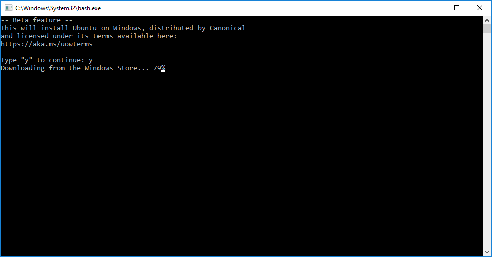
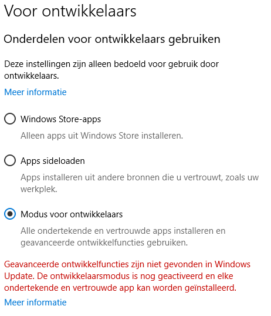

# Windows 10 Capgemini Bevindingen

Testers: Walter van Iterson, Marc van Andel

## Logboek

_(Items over inrichting en activiteiten)_

_2017-10-26 MvA_: Nieuwe image geïnstalleerd. Dat ging de eerste keer fout, want Ronald Ruijs moest een BIOS aanpassing doen (oid?) om vervolgens nogmaals het image in te spoelen. Dat was wel binnen een uur klaar. Na inloggen e.d. kon ik direct aan de slag.

_2017-10-30 MvA_: Mbv mijn [Lenovo pagina](http://github.so.kadaster.nl/andelm/local-dev-env/blob/master/lenovo.md) alle tools gedownload en geïnstalleerd. Wat gaat dat allemaal goed! Cisco AnyConnect is standaard al deel van het image en werkt direct. Super! Naar en van slaapstand werkt heel goed. Geen BSoD meer (op dit moment)! En snel!

_2017-10-31 WvI_: De nieuwe, voorgeïnstalleerde laptop ligt klaar bij local support. Eén klein probleempje: er is vandaag niemand op de Brug aanwezig. Morgenochtend mag ik hem ophalen

_2017-11-01 MvA_: [Install Bash on Windows 10](https://www.howtogeek.com/249966/how-to-install-and-use-the-linux-bash-shell-on-windows-10/); Windows 10 Developer Mode geeft een error. Bash is wel te 'enable'n.

_2017-11-01 MvA_: Docker werkt super!! KOERS draaide in één keer zonder problemen, ook in Docker Swarmmode :D

_2017-11-02 WvI_: Bij local support langs geweest, de aanvraag voor de tweede laptop was geweigerd. Inmiddels is de toestemming wel (weer) gegeven, dus zullen ze de laptop vandaag in gaan richten

## Bevindingen

_(bevindingenlijst, eventueel aangevuld met screenshots)_

_2017-10-26 MvA_: Bij het inloggen én bij ontgrendelen (!) krijg ik nog een rare melding over 'OLD password' ... maar dat is helemaal niet relevant. Door op 'Cancel' te klikken, kan ik wel gewoon door.

_2017-10-31 MvA_: Banners voor Sophos Safe Guard uitgezet, want die komen vaak voorbij, zowel dat het wel gelukt is, als dat het niet gelukt is...

_2017-10-31 MvA_: `https://intranet.kadaster.nl` toegevoegd aan trusted sites voor intranet security zone (zie [wiki](http://wiki.cs.kadaster.nl/wiki/index.php/Wiki/Tips%26Tricks#Google_Chrome))

_2017-11-01 MvA_: _Windows 10 Developer Mode_ geeft een error 'Geavanceerde ontwikkelfuncties niet gevonden in Windows Update'

